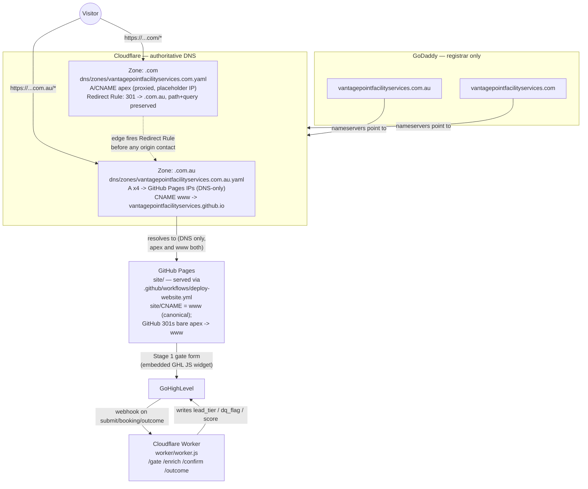
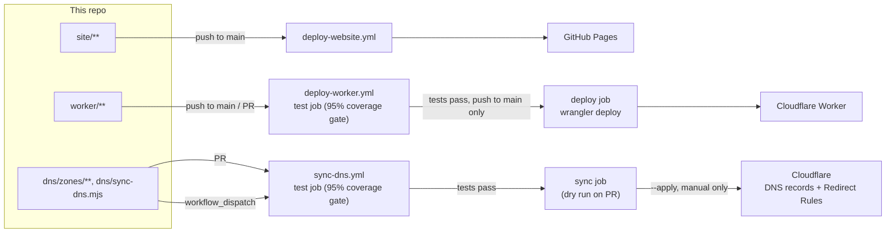
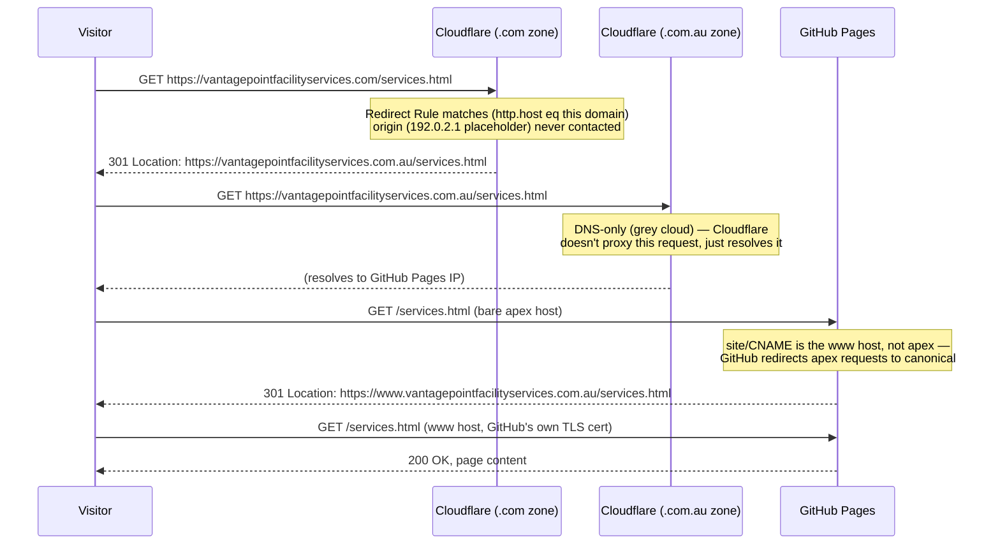

# Architecture

How the pieces in this repo — the static site, the Cloudflare Worker, and
the DNS config — fit together with the outside systems (GoDaddy,
Cloudflare, GitHub) that host and route them. See `docs/DEPLOYMENT.md` for
the step-by-step setup runbook and `docs/DEVELOPMENT.md` for day-to-day
install/run/test.

## Domains and hosting

Two domains, one registrar (GoDaddy), one DNS provider (Cloudflare), one
hosting target (GitHub Pages) — `vantagepointfacilityservices.com` carries
no content of its own; it exists only to redirect to the real site.

`dns/sync-dns.mjs` is what actually creates/updates the records and the
redirect rule shown above — see `dns/README.md` for the zone-file format.

## CI/CD

Three independent GitHub Actions workflows, each scoped to the part of the
repo it deploys — a change to `worker/` never touches the site, and vice
versa.

Key asymmetry, deliberate: the worker's `deploy` job runs automatically on
every push to `main` once tests pass. The DNS `sync` job never auto-applies
— even a passing test run only dry-runs on a PR; an actual `--apply`
requires a manual `workflow_dispatch`. A bad DNS record or redirect can
break email or take the live site down with no test suite able to catch
that in advance; a bad Worker deploy is caught by the request/response
shape tests before it ships.

## Request lifecycle: a visitor hitting the `.com` domain

Three redirect hops from the `.com` domain to the final page — worth
knowing if this ever shows up as a Lighthouse/PageSpeed warning, or if a
paid-ad landing URL should just use the canonical `www.…com.au` host
directly to avoid the extra round trips.

## Components at a glance

| Component | Role | Configured in |
|---|---|---|
| GoDaddy | Domain registrar for both domains | Nameservers only — no DNS records managed here after initial handoff |
| Cloudflare DNS | Authoritative DNS for both zones | `dns/zones/*.yaml`, applied by `dns/sync-dns.mjs` |
| Cloudflare Redirect Rules | `.com` → `.com.au` 301 | `dns/zones/vantagepointfacilityservices.com.yaml`'s `redirects:` block |
| GitHub Pages | Hosts the static site; redirects bare apex → `www` | `site/`, `site/CNAME` (= `www.vantagepointfacilityservices.com.au`), `.github/workflows/deploy-website.yml` |
| Cloudflare Workers | Lead-scoring webhook receiver | `worker/worker.js`, `worker/wrangler.toml`, `.github/workflows/deploy-worker.yml` |
| GoHighLevel | CRM — sends webhooks to the Worker, receives writes back | External; field structure documented in the `vpos` repo |
