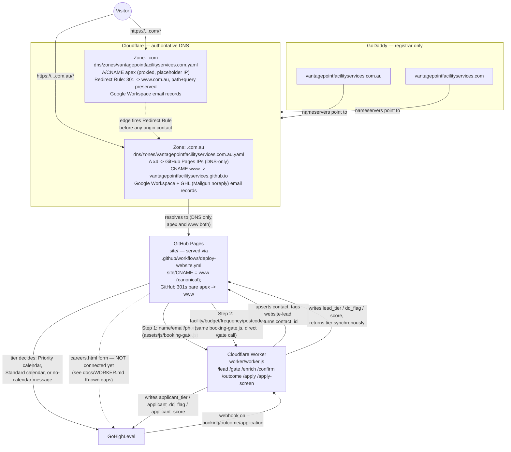
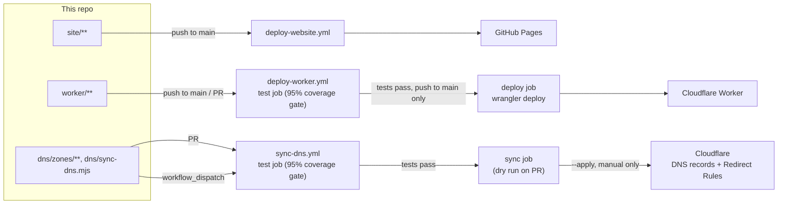
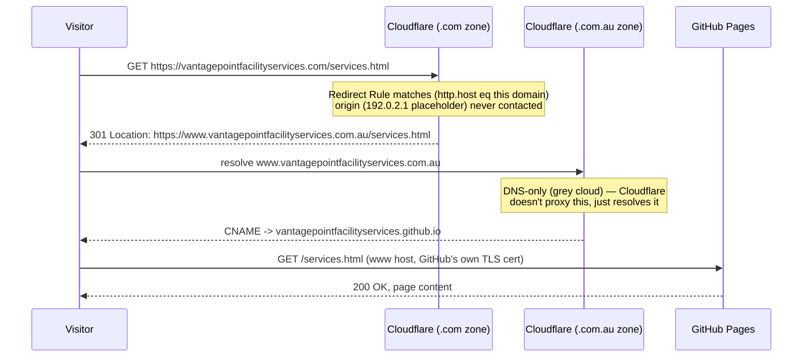

# Architecture

How the pieces in this repo — the static site, the Cloudflare Worker, and
the DNS config — fit together with the outside systems (GoDaddy,
Cloudflare, GitHub) that host and route them. See `docs/DEPLOYMENT.md` for
the step-by-step setup runbook and `docs/DEVELOPMENT.md` for day-to-day
install/run/test.

## Domains and hosting

Two domains, one registrar (GoDaddy), one DNS provider (Cloudflare), one
hosting target (GitHub Pages) — `vantagepointfacilityservices.com` carries
no content of its own; it exists only to redirect to the real site.

```mermaid
flowchart TD
    subgraph GD["GoDaddy — registrar only"]
        D1["vantagepointfacilityservices.com.au"]
        D2["vantagepointfacilityservices.com"]
    end

    D1 -- "nameservers point to" --> CF
    D2 -- "nameservers point to" --> CF

    subgraph CF["Cloudflare — authoritative DNS"]
        Z1["Zone: .com.au\ndns/zones/vantagepointfacilityservices.com.au.yaml\nA x4 -> GitHub Pages IPs (DNS-only)\nCNAME www -> vantagepointfacilityservices.github.io\nGoogle Workspace + GHL (Mailgun noreply) email records"]
        Z2["Zone: .com\ndns/zones/vantagepointfacilityservices.com.yaml\nA/CNAME apex (proxied, placeholder IP)\nRedirect Rule: 301 -> www.com.au, path+query preserved\nGoogle Workspace email records"]
    end

    Visitor(("Visitor")) -- "https://...com.au/*" --> Z1
    Visitor -- "https://...com/*" --> Z2
    Z2 -. "edge fires Redirect Rule\nbefore any origin contact" .-> Z1
    Z1 -- "resolves to (DNS only,\napex and www both)" --> GHP["GitHub Pages\nsite/ — served via\n.github/workflows/deploy-website.yml\nsite/CNAME = www (canonical);\nGitHub 301s bare apex -> www"]

    GHP -- "Step 1: name/email/phone\n(assets/js/booking-gate.js)" --> W["Cloudflare Worker\nworker/worker.js\n/lead /gate /enrich /confirm /outcome /apply /apply-screen"]
    W -- "upserts contact, tags website-lead,\nreturns contact_id" --> GHP
    GHP -- "Step 2: facility/budget/frequency/postcode\n(same booking-gate.js, direct /gate call)" --> W
    W -- "writes lead_tier / dq_flag / score,\nreturns tier synchronously" --> GHP
    GHP -- "tier decides: Priority calendar,\nStandard calendar, or no-calendar message" --> GHL["GoHighLevel"]
    GHP -. "careers.html form — NOT connected yet\n(see docs/WORKER.md Known gaps)" .-> GHL
    GHL -- "webhook on booking/outcome/application" --> W
    W -- "writes applicant_tier / applicant_dq_flag / applicant_score" --> GHL
```

`/lead` and `/gate` are called directly by the browser (not via a GHL-hosted
embedded form) — see [`WORKER.md`](WORKER.md) for the full end-to-end Worker
guide, and `worker/README.md` and `assets/js/booking-gate.js` for
the two-step gate this implements. `careers.html`'s application form is
**not connected to anything yet** — a plain `<form>` with no action or
script (see `WORKER.md` → Known gaps).

`dns/sync-dns.mjs` is what actually creates/updates the records and the
redirect rule shown above — see `dns/README.md` for the zone-file format.

## CI/CD

Three independent GitHub Actions workflows, each scoped to the part of the
repo it deploys — a change to `worker/` never touches the site, and vice
versa.

```mermaid
flowchart LR
    subgraph Repo["This repo"]
        S["site/**"]
        W["worker/**"]
        DZ["dns/zones/**, dns/sync-dns.mjs"]
    end

    S -- "push to main" --> WF1["deploy-website.yml"]
    WF1 --> Pages["GitHub Pages"]

    W -- "push to main / PR" --> WF2T["deploy-worker.yml\ntest job (95% coverage gate)"]
    WF2T -- "tests pass, push to main only" --> WF2D["deploy job\nwrangler deploy"]
    WF2D --> CFW["Cloudflare Worker"]

    DZ -- "PR" --> WF3T["sync-dns.yml\ntest job (95% coverage gate)"]
    WF3T -- "tests pass" --> WF3S["sync job\n(dry run on PR)"]
    DZ -- "workflow_dispatch" --> WF3T
    WF3S -- "--apply, manual only" --> CFD["Cloudflare\nDNS records + Redirect Rules"]
```

Before uploading, `deploy-website.yml` runs `site/scripts/cache-bust.mjs`,
which appends `?v=<commit>` to every local CSS/JS URL in the deployed copy
of the pages (and to relative JS imports). GitHub Pages caches files for 10
minutes, so without this a browser could run a freshly deployed page against
the previous deploy's cached JavaScript. The repo's source files never carry
the `?v=`.

Key asymmetry, deliberate: the worker's `deploy` job runs automatically on
every push to `main` once tests pass. The DNS `sync` job never auto-applies
— even a passing test run only dry-runs on a PR; an actual `--apply`
requires a manual `workflow_dispatch`. A bad DNS record or redirect can
break email or take the live site down with no test suite able to catch
that in advance; a bad Worker deploy is caught by the request/response
shape tests before it ships.

## Request lifecycle: a visitor hitting the `.com` domain

One redirect hop from the `.com` domain straight to the canonical
`www.…com.au` page (changed 2026-09-29 — it used to go via the bare
`.com.au` apex, adding two more hops). Paid-ad and printed URLs should
still use the canonical `www.…com.au` host directly.

```mermaid
sequenceDiagram
    participant V as Visitor
    participant CF2 as Cloudflare (.com zone)
    participant CF1 as Cloudflare (.com.au zone)
    participant GH as GitHub Pages

    V->>CF2: GET https://vantagepointfacilityservices.com/services.html
    Note over CF2: Redirect Rule matches (http.host eq this domain)<br/>origin (192.0.2.1 placeholder) never contacted
    CF2-->>V: 301 Location: https://www.vantagepointfacilityservices.com.au/services.html
    V->>CF1: resolve www.vantagepointfacilityservices.com.au
    Note over CF1: DNS-only (grey cloud) — Cloudflare<br/>doesn't proxy this, just resolves it
    CF1-->>V: CNAME -> vantagepointfacilityservices.github.io
    V->>GH: GET /services.html (www host, GitHub's own TLS cert)
    GH-->>V: 200 OK, page content
```

## Components at a glance

| Component | Role | Configured in |
|---|---|---|
| GoDaddy | Domain registrar for both domains | Nameservers only — no DNS records managed here after initial handoff |
| Cloudflare DNS | Authoritative DNS for both zones | `dns/zones/*.yaml`, applied by `dns/sync-dns.mjs` |
| Cloudflare Redirect Rules | `.com` → `www.com.au` 301 | `dns/zones/vantagepointfacilityservices.com.yaml`'s `redirects:` block |
| GitHub Pages | Hosts the static site; redirects bare apex → `www` | `site/`, `site/CNAME` (= `www.vantagepointfacilityservices.com.au`), `.github/workflows/deploy-website.yml` |
| Cloudflare Workers | Lead-scoring and applicant-scoring webhook receiver | `worker/worker.js`, `worker/wrangler.toml`, `.github/workflows/deploy-worker.yml` |
| GoHighLevel | CRM — the website and AI Receptionist create/score contacts through the Worker; GHL workflows webhook the Worker and act on its fields; also sends email from `noreply.vantagepointfacilityservices.com.au` via Mailgun | External; setup and IDs in the `vpos` repo (`shared/integrations/gohighlevel/`) |
| Google Workspace | Mailboxes on both domains (MX/SPF/DKIM/DMARC) | Google Admin; the DNS records are listed in both `dns/zones/*.yaml` files |
