# The Lead Scoring Worker

This is the plain-English guide to the Cloudflare Worker in `worker/`: what
it is, how it's set up, and exactly what happens — step by step — when a
visitor fills in the booking form, and later as that lead moves through
GoHighLevel (GHL).

For how the Worker fits alongside the website, DNS and GitHub Pages, see
[`ARCHITECTURE.md`](ARCHITECTURE.md). For the scoring rules' business
reasoning, see the vpos repo:
`commercial/docs/lead-scoring-and-two-stage-gate-form.md` (leads) and
`commercial/docs/recruitment-scoring-and-application-form.md` (applicants).

---

## Contents

1. [What the Worker is, in one paragraph](#1-what-the-worker-is-in-one-paragraph)
2. [The big picture](#2-the-big-picture)
3. [Where it lives and how it's configured](#3-where-it-lives-and-how-its-configured)
4. [The lead journey, stage by stage](#4-the-lead-journey-stage-by-stage)
5. [The job-applicant journey](#5-the-job-applicant-journey)
6. [Inside the Worker: how every request is handled](#6-inside-the-worker-how-every-request-is-handled)
7. [What the Worker writes to GHL](#7-what-the-worker-writes-to-ghl)
8. [Setting it up from scratch](#8-setting-it-up-from-scratch)
9. [Deploying changes](#9-deploying-changes)
10. [Testing and verifying](#10-testing-and-verifying)
11. [Troubleshooting](#11-troubleshooting)
12. [Changing the business rules](#12-changing-the-business-rules)
13. [Known gaps](#13-known-gaps)

---

## 1. What the Worker is, in one paragraph

The Worker is a small program that runs on Cloudflare's network at
`https://worker.vantagepointfacilityservices.com.au`. It sits **between the
website and GHL**. The website can't talk to GHL directly — doing so would
mean putting the GHL API key in the browser, where anyone could copy it. So
the website talks to the Worker, and the Worker (which holds the key
privately) talks to GHL. Along the way it does the thinking: it decides
whether a lead is a good fit, scores it, picks a tier (Priority / Standard /
Nurture), and writes all of that onto the contact in GHL so GHL workflows
can act on it.

It has **no database of its own**. GHL is the single source of truth; the
Worker just reads what it's sent, applies the rules, and writes results
back.

---

## 2. The big picture

Everyone and everything that talks to the Worker, and what flows between
them:

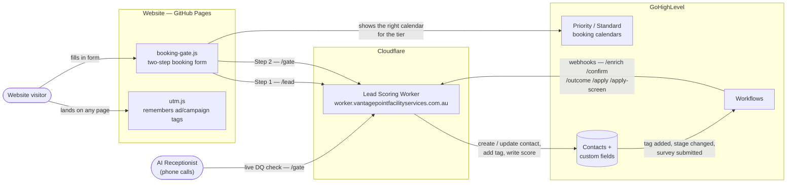

There are **two ways in**:

- **Directly from the browser** — the website's booking form calls `/lead`
  (Step 1) and `/gate` (Step 2). The AI Receptionist also calls `/gate`
  mid-call.
- **From GHL workflows** — when something happens in GHL (a survey comes
  back, a walkthrough is a no-show, a proposal is lost), a workflow sends
  a webhook to one of the other five endpoints.

### The seven endpoints at a glance

| Endpoint | Called by | When | What it does |
|---|---|---|---|
| `/lead` | Website (Step 1) | Visitor submits name/email/phone/postcode | Creates or matches the GHL contact, tags it `website-lead`, returns its ID |
| `/gate` | Website (Step 2), AI Receptionist | Visitor answers facility type / budget / frequency | Checks disqualifiers, scores, sets the tier, picks which calendar to show |
| `/enrich` | GHL workflow | Booked lead returns the optional facility-detail survey | Saves facility detail; can bump Standard → Priority |
| `/confirm` | GHL workflow | Disqualified lead answers "is your budget/frequency flexible?" | Re-qualifies them if their flexed answer clears the minimum |
| `/outcome` | GHL workflow | Walkthrough no-show, or proposal marked Lost | Moves them to the right nurture segment |
| `/apply` | GHL workflow | Job applicant submits the careers Stage 1 form | Checks they live in the service area |
| `/apply-screen` | GHL workflow | Applicant returns the Stage 2 screening survey | Checks eligibility, scores fit, sets applicant tier |

---

## 3. Where it lives and how it's configured

### The pieces

| Piece | Value | Where it's set |
|---|---|---|
| Code | `worker/worker.js` (one file, no dependencies) | This repo |
| Worker name on Cloudflare | `vpfs-lead-scoring-worker` | `worker/wrangler.toml` |
| Public address | `https://worker.vantagepointfacilityservices.com.au` | `worker/wrangler.toml` `[[routes]]` — Cloudflare creates the DNS record itself on deploy, so it is **not** in `dns/zones/` |
| Browser allowlist | `https://www.vantagepointfacilityservices.com.au`, `https://vantagepointfacilityservices.com.au` | `ALLOWED_ORIGINS` in `worker.js` |
| Deploy pipeline | GitHub Actions → `wrangler deploy` | `.github/workflows/deploy-worker.yml` |
| Cost | Free tier (100,000 requests/day) | Cloudflare account |

### Settings and secrets

| Name | Kind | What it is | How to set it |
|---|---|---|---|
| `GHL_API_KEY` | **Secret** | GHL Private Integration Token for the sub-account. Needs scopes `contacts.write` and `contacts.readonly`. | `cd worker && npx wrangler secret put GHL_API_KEY` — write-only; Cloudflare never shows it again |
| `GHL_LOCATION_ID` | Plain setting | The GHL sub-account ID (`i1xCcUSRa8PDofaJ1Oyz`). Required when creating contacts. Not secret — it appears in GHL's public webhook URLs. | `[vars]` in `worker/wrangler.toml`, deployed with the code |
| `CLOUDFLARE_WORKER_API_TOKEN` | GitHub repo secret | Lets GitHub Actions deploy the Worker. Scoped to `Account: Workers Scripts: Edit` only. | GitHub → Settings → Secrets and variables → Actions |

### What must exist in GHL

The Worker writes to GHL **custom fields by key**. If a field doesn't exist
in the sub-account (or its key is spelled differently), GHL silently drops
that value — so these need to be created in GHL → Settings → Custom Fields
with exactly these keys:

| Group | Custom field keys |
|---|---|
| Captured at Step 1 | `postcode`, `channel`, `utm_source`, `utm_medium`, `utm_campaign`, `utm_term`, `utm_content` |
| Written by `/gate` | `lead_score`, `lead_tier`, `dq_flag`, `sla_flag`, `lead_captured_at` |
| Read/written by `/enrich` | `size_sqm`, `headcount`, `floor_count`, `lifts_present`, `bathroom_count`, `kitchen_count`, `breakroom_count`, `meeting_room_count`, `special_requests`, `supplies_provided`, `equipment_needed`, `contract_renewal_date`, `contract_renewal_months_out` |
| Read/written by `/confirm` | `budget_flexible`, `flexible_budget_amount`, `frequency_flexible`, `flexible_frequency`, `monthly_budget`, `cleaning_frequency`, `facility_type` |
| Read/written by `/outcome` | `outcome_type`, `reschedule_attempts`, `loss_reason`, `noshow_attempts`, `lost_at_proposal_date` |
| Applicants | `applicant_stage`, `applicant_tier`, `applicant_score`, `applicant_dq_flag`, `applicant_captured_at`, `applicant_screened_at`, `applicant_blue_card_eligible`, `applicant_subcontractor_ready`, plus the survey fields listed in [section 5](#5-the-job-applicant-journey) |

Plus the tag, which already exists in the sub-account:

| Field | Value |
|---|---|
| Name | `website-lead` |
| ID | `AxqSvCibXVSHZd0ycUI4` |

The Worker adds this tag **by name** to every website enquiry via `/lead`,
so the ID is for reference only (e.g. finding it in GHL or its API). If the
tag is ever renamed in GHL, change `WEBSITE_LEAD_TAG` in `worker.js` to
match, or the Worker will silently create a new tag with the old name.

Also required:

- **Workflow** triggered by **Contact Tag → Tag Added → `website-lead`** —
  the new-lead alert / follow-up. (Not an Inbound Webhook trigger: that's a
  premium per-run trigger with a public URL, and it can't hand a contact ID
  back to the website.)
- **Workflows with a Webhook action** pointing at `/enrich`, `/confirm`,
  `/outcome`, `/apply` and `/apply-screen` (see section 4 and 5 for when each
  should fire). Each webhook must send the contact's ID as `contact_id` and
  the relevant fields under `customFields`.

---

## 4. The lead journey, stage by stage

A lead's full lifecycle, from first click to won/lost:

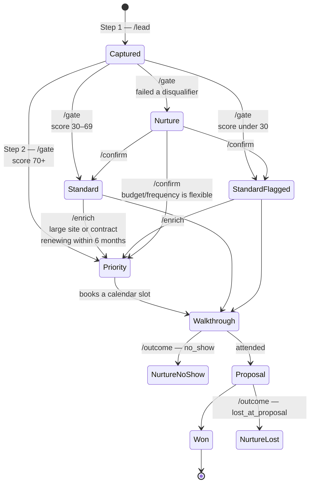

### Stage 0 — The visitor lands on the site (UTM capture)

Ads and campaign links carry tracking tags in the URL, e.g.
`services.html?utm_source=google&utm_campaign=office-gc`. Visitors rarely
book on the page they land on — they browse first — so those tags would be
lost by the time they submit the form.

`site/assets/js/utm.js` runs on **every page** and saves any `utm_*` tags
into the browser's session storage. When the visitor submits Step 1, the
form sends them along.

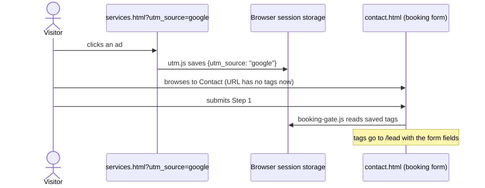

Rules: tags on the current page win over saved ones; a new campaign link
replaces saved tags; a page with no tags leaves them alone; each value is
capped at 200 characters; if the browser blocks storage, tags on the
current page still work.

### Stage 1 — `/lead`: capture the contact

The visitor enters **first name, last name, email, phone, postcode** and
clicks **Start Booking**.

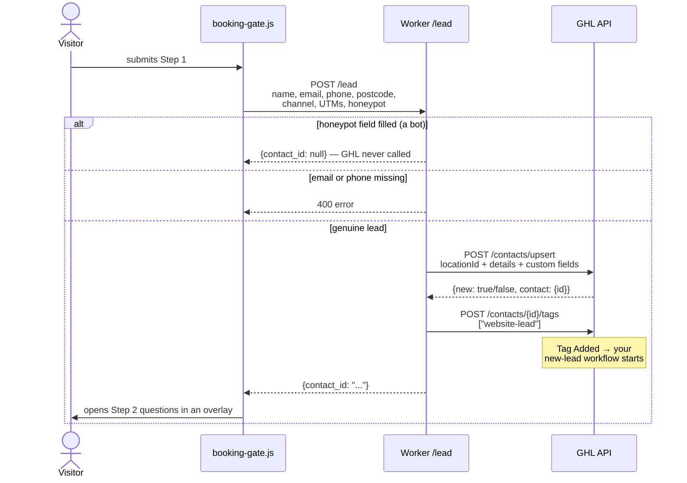

Things worth knowing:

- **Upsert, not create.** GHL matches on email/phone. A new visitor gets a
  new contact; someone already in GHL gets their existing contact updated
  and their existing ID back — so a repeat enquiry works instead of
  erroring.
- **`channel`** records which form was used: `website-homepage` or
  `website-contact` (from the form's `data-channel` attribute).
- **The tag is added separately**, through GHL's "add tags" endpoint, which
  appends. Sending tags inside the upsert could overwrite a returning
  contact's existing tags.
- **If tagging fails**, the visitor still moves on to Step 2 — the contact
  exists, only the tag-triggered workflow misses them.
- **If the upsert fails**, the Worker replies `{contact_id: null,
  ghl_error: "..."}` and the visitor sees "Something went wrong — please
  try again."
- **Tag Added only fires once per contact.** A returning contact who already
  has `website-lead` won't re-trigger the workflow.

### Stage 2 — `/gate`: qualify, score and route

The visitor answers **facility type, approximate monthly budget and
cleaning frequency** in a pop-up overlay (a modal `<dialog>`), and clicks
**See availability**. The calendar or message that follows appears in the
same overlay. If they close it, a **Continue booking** button on the page
reopens it where they left off. The browser sends
those plus the postcode from Step 1 and the `contact_id`.

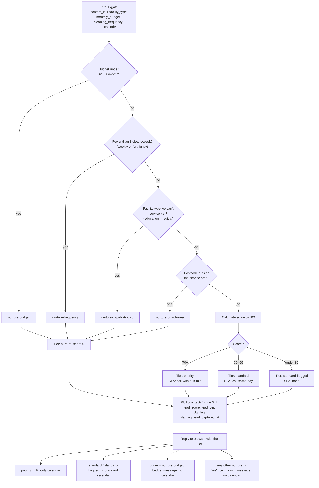

**Disqualifiers** are checked in the order shown; the first one that fails
decides the `dq_flag`. A blank answer never disqualifies.

**The score** only runs for leads that pass every disqualifier:

| Factor | Points |
|---|---|
| Budget $5,000+/month | 70 |
| Budget $2,000–$4,999 | 30 |
| Daily (7 days a week) | 20 |
| 5 days a week | 15 |
| 3 days a week | 10 |
| Office or strata | 10 |
| Construction / industrial | 5 |

**Budget alone decides the calendar.** Any $5,000+ budget scores at least
70 + 10 + 5 = **85 → Priority**; a $2,000–$4,999 budget scores at most
30 + 20 + 10 = **60 → Standard**. Frequency and facility type only rank
leads *within* a tier (e.g. in GHL views sorted by `lead_score`).

| Monthly budget | Result |
|---|---|
| $5,000+ | Priority calendar |
| $2,000–$4,999 | Standard calendar |
| Under $2,000 | No calendar — budget message: *"Unfortunately, your monthly budget is below the minimum we need…we'll check in from time to time to see if anything has changed."* |

**Frequency options** on the form: Daily, 3 days a week, 5 days a week,
Weekly, Fortnightly (values `daily`, `three_days_week`, `five_days_week`,
`weekly`, `fortnightly`). Weekly and fortnightly are under the 3-per-week
minimum, so they're disqualified (`nurture-frequency`). The old value
`few_times_week` is still accepted as 3 days a week, in case the AI
Receptionist or a GHL survey sends it.

**Which "no calendar" message?** A lead disqualified on budget sees the
budget message above. Leads disqualified for any other reason (frequency,
facility type, postcode) see the general *"Thanks — we'll be in touch"*
message.

**Service-area postcodes** are currently only **4211, 4212, 4226, 4227**.
Any other postcode is out of area (see [section 12](#12-changing-the-business-rules)).

The **AI Receptionist** calls this same `/gate` endpoint live on the phone,
so phone and web leads are judged by identical rules.

### Stage 3 — `/enrich`: optional facility detail after booking

After a Priority/Standard lead books, GHL can send them an optional survey
(size, headcount, floors, bathrooms, kitchens, current contract renewal
date, etc.). When it comes back, a GHL workflow webhooks `/enrich`.

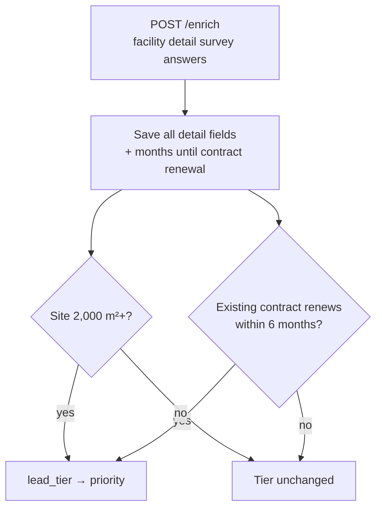

`/enrich` can only move a lead **up** to Priority. It never disqualifies or
demotes — that was settled at `/gate`.

### Stage 4 — `/confirm`: second chance for disqualified leads

A lead disqualified on **budget** or **frequency** gets one follow-up
question from GHL ("is that budget a hard ceiling?" / "would you consider
3 days a week?"). Their answer webhooks `/confirm`. Out-of-area and
capability-gap leads don't get this — they can't change those facts — and
that routing lives in the GHL workflow, not the Worker.

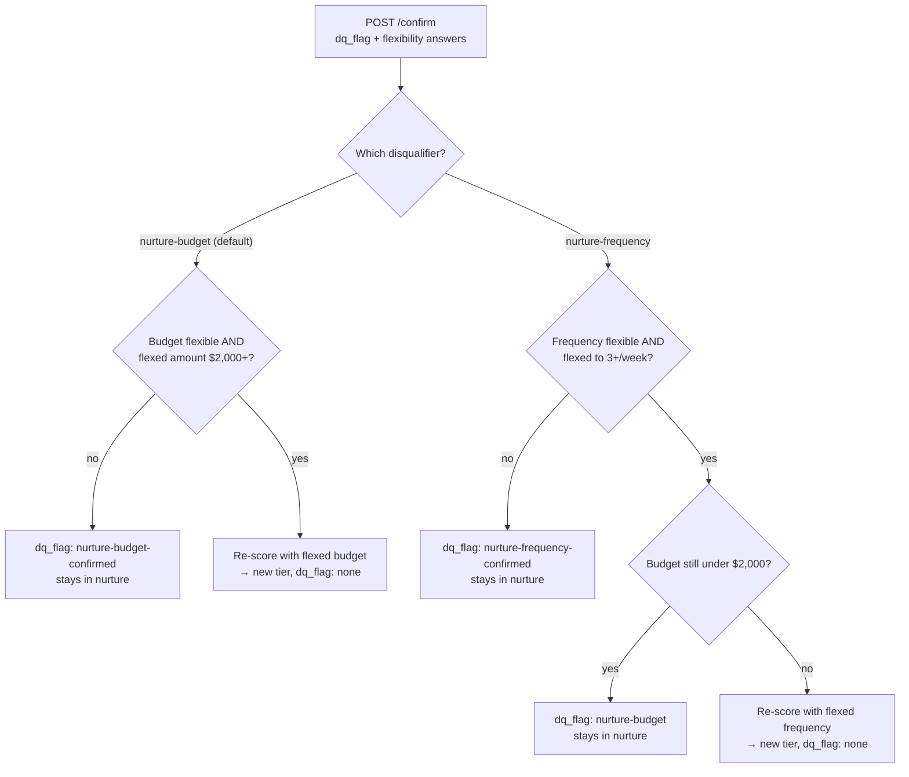

### Stage 5 — `/outcome`: no-shows and lost proposals

Fired by GHL pipeline-stage workflows, with `outcome_type` set by the
workflow:

| `outcome_type` | When | Writes |
|---|---|---|
| `no_show` | Walkthrough missed and reschedule attempts exhausted | `lead_tier: nurture`, `dq_flag: nurture-no-show`, `noshow_attempts` |
| `lost_at_proposal` | Proposal marked Lost after a real walkthrough | `lead_tier: nurture`, `dq_flag: nurture-lost-<reason>` (e.g. `nurture-lost-price`), `lost_at_proposal_date` |

Each gets its own nurture segment — these leads already passed
qualification, so they shouldn't get the same drip as a gate-stage DQ. Any
other `outcome_type` is rejected with a 400.

---

## 5. The job-applicant journey

Separate from leads: the careers funnel scores cleaners who apply. Both
endpoints are called by GHL workflows, not the browser.

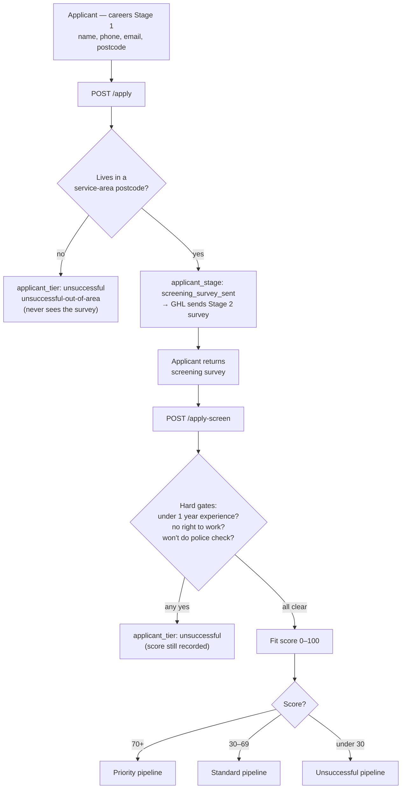

**Fit score:** experience 1–3 years 25 / 3+ years 40; availability
business hours 10 / after hours 20 / flexible 25; reliable transport 15;
physically capable 10; attitude "take pride" 5 / "genuinely passionate" 10.

**Also recorded, never scored:** Blue Card eligibility
(`applicant_blue_card_eligible`), own insurance + ABN
(`applicant_subcontractor_ready`), document uploads (police check, Blue
Card, insurance certificate) and start availability.

> ⚠️ See [Known gaps](#13-known-gaps): the careers page form is not
> currently connected to anything.

---

## 6. Inside the Worker: how every request is handled

Every request goes through the same front door before reaching an
endpoint:

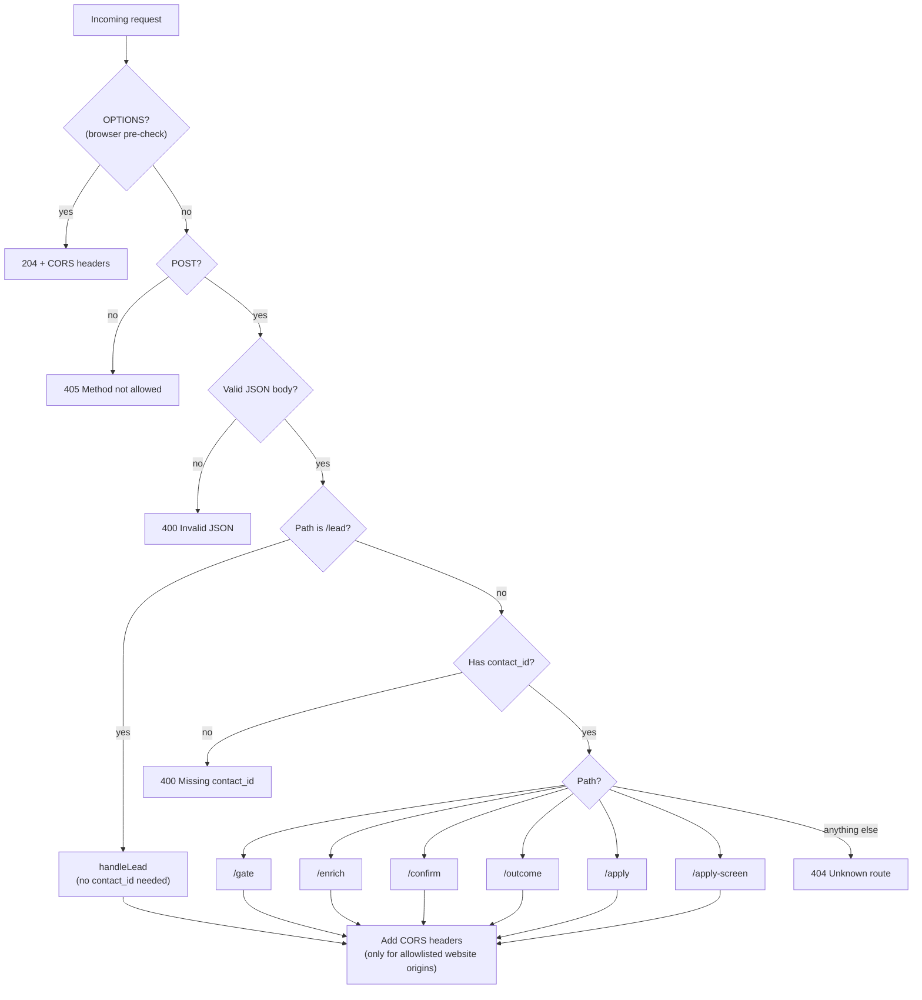

### How it talks to GHL

The Worker makes exactly three kinds of GHL API call, all to
`https://services.leadconnectorhq.com` with `Authorization: Bearer
<GHL_API_KEY>` and `Version: 2021-07-28`:

| Call | Used by | Purpose |
|---|---|---|
| `POST /contacts/upsert` | `/lead` | Create the contact, or update the one matching email/phone |
| `POST /contacts/{id}/tags` | `/lead` | Add `website-lead` without touching other tags |
| `PUT /contacts/{id}` | every other endpoint | Write scores, tiers and flags onto an existing contact |

A failed GHL write **never crashes the Worker**. Endpoints return the
outcome in a `ghl_update` (or `ghl_error`) field so the caller can see what
went wrong.

### Security, honestly

| Protection | What it does | What it doesn't do |
|---|---|---|
| API key stays in the Worker | The browser never sees the GHL key | — |
| Origin allowlist (CORS) | Stops *other websites'* pages calling the Worker from a visitor's browser | Doesn't stop scripts or tools like `curl` — they ignore CORS |
| Honeypot field | A hidden field humans can't see; bots that fill it get a fake success and nothing reaches GHL | Doesn't stop smarter bots |
| No login on any endpoint | — | Anyone who knows the URL can post to it. Adding Cloudflare Turnstile to the form (free) is the fix if spam appears. |

---

## 7. What the Worker writes to GHL

| Endpoint | Fields written |
|---|---|
| `/lead` | first/last name, email, phone, `postcode`, `channel`, `utm_*` (only those present), tag `website-lead` |
| `/gate` | `lead_score`, `lead_tier`, `dq_flag`, `sla_flag`, `lead_captured_at`, `utm_*` if sent |
| `/enrich` | the facility detail fields, `contract_renewal_months_out`, and `lead_tier: priority` if bumped |
| `/confirm` | `dq_flag` (confirmed nurture), or `lead_score`, `lead_tier`, `dq_flag: none` plus the flexed `monthly_budget` / `cleaning_frequency` |
| `/outcome` | `lead_tier: nurture`, `dq_flag`, `noshow_attempts` or `lost_at_proposal_date` |
| `/apply` | `postcode`, `applicant_stage` or `applicant_tier`, `applicant_dq_flag`, `applicant_captured_at` |
| `/apply-screen` | `applicant_score`, `applicant_tier`, `applicant_dq_flag`, `applicant_screened_at`, eligibility flags, document links, `start_availability` |

**Tier values:** `priority`, `standard`, `standard-flagged`, `nurture`
(leads); `priority`, `standard`, `unsuccessful`, `pending` (applicants).

**SLA values:** `call-within-15min` (Priority), `call-same-day`
(Standard), `none`.

---

## 8. Setting it up from scratch

Only needed for a brand-new environment — the live Worker is already set
up.

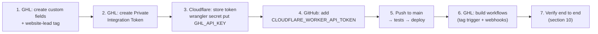

1. **GHL custom fields and tag.** In the sub-account: Settings → Custom
   Fields, create every key in [section 3](#what-must-exist-in-ghl). Create
   the `website-lead` tag under Settings → Tags (in a fresh sub-account it
   would also be auto-created the first time the Worker uses it, but it
   must exist before you can pick it in the workflow trigger).
2. **GHL token.** Switch into the **sub-account** (not agency view) →
   Settings → Private Integrations → Create new integration → scopes
   `contacts.write` and `contacts.readonly` → copy the token (shown once;
   keep it in your password manager).
3. **Store the token in Cloudflare.** From the repo:
   `cd worker && npx wrangler secret put GHL_API_KEY`, then paste.
4. **Let GitHub deploy.** Create a Cloudflare API token with only
   `Account: Workers Scripts: Edit`, and save it as the
   `CLOUDFLARE_WORKER_API_TOKEN` repo secret.
5. **Deploy.** Merge to `main`. See [section 9](#9-deploying-changes).
6. **GHL workflows.**
   - New-lead workflow: trigger **Contact Tag → Tag Added → `website-lead`**.
   - Survey/stage workflows: a **Webhook** action POSTing to
     `https://worker.vantagepointfacilityservices.com.au/<endpoint>` with
     `contact_id` and the relevant `customFields`.
7. **Verify** with [section 10](#10-testing-and-verifying).

If the sub-account ever changes, update `GHL_LOCATION_ID` in
`worker/wrangler.toml` **and** issue a new token from the new sub-account.

---

## 9. Deploying changes

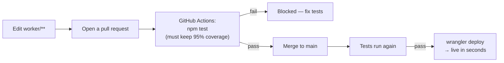

- Deploys are **automatic** on every push to `main` that touches
  `worker/**`, and **only** if every test passes and coverage stays at 95%
  or above.
- Plain settings in `wrangler.toml` (like `GHL_LOCATION_ID`) ship with the
  deploy. **Secrets don't** — they're set once with `wrangler secret put`
  and persist across deploys.
- The website deploys separately (`deploy-website.yml`). A change that
  touches both `site/` and `worker/` deploys both, independently — make sure
  the Worker change is safe to go live before or after the site change.

---

## 10. Testing and verifying

### Automated tests (no live GHL calls)

```bash
cd worker && npm test   # Worker: scoring rules + every endpoint, GHL mocked
cd site && npm test     # Website: booking-gate.js and utm.js
```

### Verifying the live system

Use an email and mobile number that are **not already in GHL** (the upsert
matches on phone too, so a real customer's number would update *their*
contact), and a postcode inside the service area (e.g. **4211**). Use fresh
details for each run you want to trigger the tag workflow.

**1. Call the Worker directly**

```bash
curl -s -X POST https://worker.vantagepointfacilityservices.com.au/lead \
  -H "Content-Type: application/json" \
  -H "Origin: https://www.vantagepointfacilityservices.com.au" \
  -d '{"first_name":"Test","last_name":"Lead","email":"you+leadtest1@example.com",
       "phone":"+61400000001","postcode":"4211","channel":"website-contact",
       "utm_source":"test","utm_campaign":"verify"}'
```

Expect `{"contact_id":"..."}`. In GHL, the contact should exist with tag
`website-lead`, Channel `website-contact`, Postcode `4211`, UTM Source
`test`, and the new-lead workflow should show a run in its Execution Logs.
Send the same request again: same `contact_id`, no second workflow run.

**2. Score it**

```bash
curl -s -X POST https://worker.vantagepointfacilityservices.com.au/gate \
  -H "Content-Type: application/json" \
  -d '{"contact_id":"<ID FROM STEP 1>","customFields":{"facility_type":"office",
       "monthly_budget":"6000","cleaning_frequency":"daily","postcode":"4211"}}'
```

Expect `"tier":"priority"`, `"sla_flag":"call-within-15min"` and
`"ghl_update":{"success":true}`. The contact's Lead Score should read 100.

**3. The real form**

Open
`https://www.vantagepointfacilityservices.com.au/services.html?utm_source=test&utm_campaign=formcheck`,
click through to **Contact**, complete both steps with fresh details, and
check: Step 2 appears, the right calendar shows, and the GHL contact has
the tag, Channel, UTMs and score.

**4. Clean up** — delete the test contacts in GHL so they don't skew
reports and so the same details can re-trigger Tag Added later.

---

## 11. Troubleshooting

| Symptom | Likely cause | Fix |
|---|---|---|
| Visitor sees "Something went wrong" on Step 1 | GHL rejected the upsert | `curl` `/lead` as in section 10 and read `ghl_error` |
| `ghl_error` mentions 401 / unauthorized | Token wrong, expired, or from another sub-account | New Private Integration Token → `wrangler secret put GHL_API_KEY` |
| `ghl_error` mentions `locationId` | `GHL_LOCATION_ID` wrong or missing | Check `worker/wrangler.toml`, redeploy |
| Contact created but Channel / Postcode / UTMs blank | Custom field keys in GHL don't match | Create/rename fields to the keys in section 3 |
| Contact created, no workflow run | Workflow not published, trigger not Tag Added `website-lead`, or contact already had the tag | Check the trigger; test with a fresh contact |
| Every lead lands in nurture with `nurture-out-of-area` | Postcode not in `SERVICE_POSTCODES` | Add it — see section 12 |
| Browser console shows a CORS error | Site served from an address not in `ALLOWED_ORIGINS` (e.g. a preview URL) | Add that origin in `worker.js` |
| Changes merged but not live | Tests failed in GitHub Actions, so deploy was skipped | Check the Actions tab for `deploy-worker.yml` |
| `/enrich`, `/confirm` etc. return 400 "Missing contact_id" | GHL webhook isn't sending the contact ID as `contact_id` | Add it to the webhook action's body |

---

## 12. Changing the business rules

All rules live at the top of `worker/worker.js` under `CONFIG`:

| To change… | Edit |
|---|---|
| Service-area postcodes (leads **and** applicants) | `SERVICE_POSTCODES` |
| Minimum monthly budget (under → nurture) | `MIN_MONTHLY_SPEND` |
| Priority budget (at or over → Priority) | `PRIORITY_MONTHLY_SPEND` |
| Frequency options and their cleans per week | `FREQUENCY_TO_WEEKLY` — plus the radio buttons in `site/index.html` and `site/contact.html` |
| Minimum cleans per week | `MIN_WEEKLY_CLEANS` |
| Facility types you can service | `CAPABLE_FACILITY_TYPES` — add `"education"`, `"medical"` once the Blue Card / clinical bench is ready |
| Contract-renewal bump window | `CONTRACT_RENEWAL_PRIORITY_THRESHOLD_MONTHS` |
| Tier cut-offs | `tierFromScore()` (leads), `applicantTierFromScore()` (applicants) |
| The website-lead tag name | `WEBSITE_LEAD_TAG` — and update the GHL workflow trigger to match |

Then update the tests in `worker/test/` to match, and deploy as in
section 9. Rule changes should also be reflected in the vpos scoring docs.

---

## 13. Known gaps

- **The careers form isn't connected.** `site/careers.html` has a plain
  `<form>` with no `action` and no script attached, so submitting it just
  reloads the page — no applicant reaches GHL or `/apply`. It needs either
  a GHL form embed (with a workflow webhooking `/apply`) or its own
  browser-side script like `booking-gate.js`.
- **Only four service-area postcodes** (4211, 4212, 4226, 4227). Many Gold
  Coast leads will be disqualified as out-of-area until this list is
  extended.
- **No authentication on endpoints** — see [Security](#security-honestly).
- **Tag Added fires once per contact**, so a returning enquirer doesn't
  re-run the new-lead workflow.
